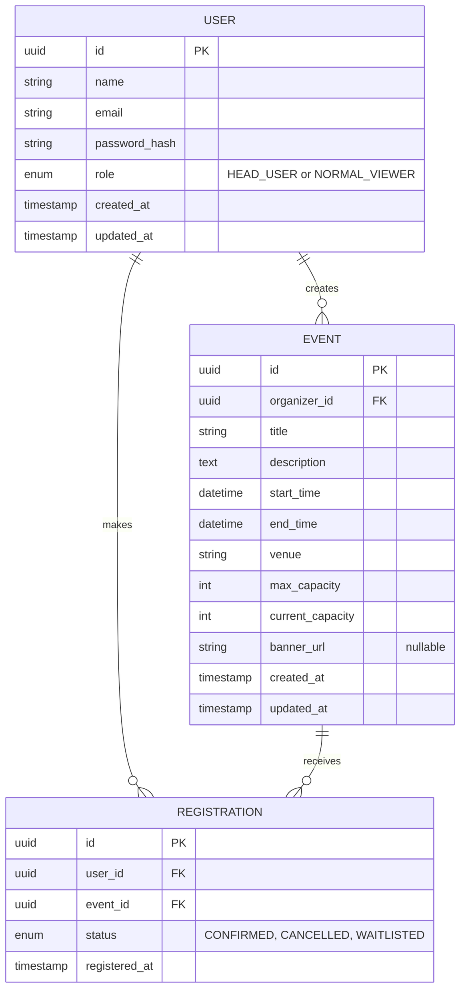

# Event Management System - Database Design

Based on the requirements in `idea.md` (Users, Roles, Events, Registrations), a relational database (like PostgreSQL or MySQL) is the best fit for managing the structured data and relationships.

## 1. Entity-Relationship Diagram (ERD)

## 2. Table Definitions & Schemas

### `users` Table
Stores authentication and profile information for all users (both Head Users and Normal Viewers).

| Column Name | Data Type | Constraints | Description |
| :--- | :--- | :--- | :--- |
| `id` | UUID | Primary Key, Default: `uuid_generate_v4()` | Unique identifier for the user. |
| `name` | VARCHAR(255) | Not Null | Full name of the user. |
| `email` | VARCHAR(255) | Not Null, Unique | Email address used for login and notifications. |
| `password_hash`| VARCHAR(255) | Not Null | Bcrypt hashed password. |
| `role` | ENUM | Not Null, Default: `NORMAL_VIEWER` | Enum of `HEAD_USER` or `NORMAL_VIEWER`. |
| `created_at` | TIMESTAMP | Default: `CURRENT_TIMESTAMP` | Record creation time. |
| `updated_at` | TIMESTAMP | Default: `CURRENT_TIMESTAMP` | Last updated time. |

### `events` Table
Stores details of the events created by Head Users.

| Column Name | Data Type | Constraints | Description |
| :--- | :--- | :--- | :--- |
| `id` | UUID | Primary Key | Unique identifier for the event. |
| `organizer_id` | UUID | Foreign Key (`users.id`), Not Null | References the Head User who created the event. |
| `title` | VARCHAR(255) | Not Null | Title of the event. |
| `description` | TEXT | Not Null | Detailed description of the event. |
| `start_time` | TIMESTAMP | Not Null | Start date and time of the event. |
| `end_time` | TIMESTAMP | Nullable | End date and time of the event. |
| `venue` | VARCHAR(255) | Not Null | Physical location or virtual link. |
| `max_capacity` | INTEGER | Not Null, Check `> 0` | Maximum number of allowed attendees. |
| `current_capacity`| INTEGER | Not Null, Default: `0` | Tracks current number of confirmed attendees. |
| `banner_url` | VARCHAR(512) | Nullable | URL to the uploaded event banner/image. |
| `created_at` | TIMESTAMP | Default: `CURRENT_TIMESTAMP` | Record creation time. |
| `updated_at` | TIMESTAMP | Default: `CURRENT_TIMESTAMP` | Last updated time. |

### `registrations` Table
Tracks which Normal Viewers are attending which Events (Many-to-Many join table with extra metadata).

| Column Name | Data Type | Constraints | Description |
| :--- | :--- | :--- | :--- |
| `id` | UUID | Primary Key | Unique identifier for the registration. |
| `user_id` | UUID | Foreign Key (`users.id`), Not Null | References the Normal Viewer. |
| `event_id` | UUID | Foreign Key (`events.id`), Not Null | References the Event. |
| `status` | ENUM | Not Null, Default: `CONFIRMED`| Enum: `CONFIRMED`, `CANCELLED`, `WAITLISTED`. |
| `registered_at` | TIMESTAMP | Default: `CURRENT_TIMESTAMP` | Date and time the registration occurred. |

*Note: A unique constraint should be placed on `(user_id, event_id)` to prevent a user from registering for the same event multiple times.*

## 3. Key Database Operations & Triggers (Future Considerations)
- **Concurrency Control:** When a user registers, the database needs a transaction or row-level lock (`SELECT ... FOR UPDATE`) to ensure `current_capacity` does not exceed `max_capacity` when multiple users register at the exact same time.
- **Cascading Deletes:** If a Head User deletes an event, all associated `registrations` should be deleted (or marked as cancelled) via `ON DELETE CASCADE`.
